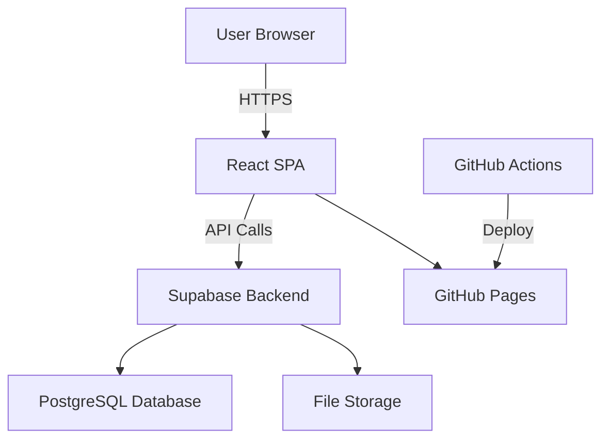
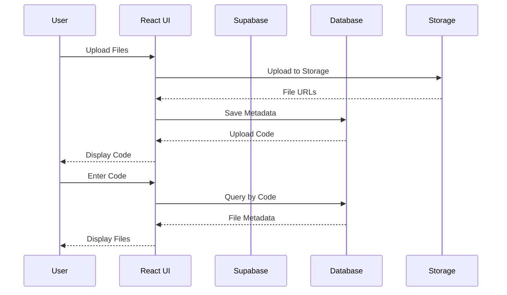

# Architecture & Design

## System Architecture Overview

ClipShare follows a modern, serverless architecture pattern that ensures scalability, reliability, and ease of maintenance. The application is built as a Single Page Application (SPA) with a Backend-as-a-Service (BaaS) approach.



## Frontend Architecture

### Component Hierarchy

```
App.jsx (Root Component)
├── ParticlesBackground.jsx (Visual Effects)
├── Navbar.jsx (Navigation)
├── UploadPage.jsx (File Upload)
│   ├── File Drop Zone
│   ├── Progress Indicator
│   └── Code Display
├── ReceivePage.jsx (File Download)
│   ├── Code Input Form
│   └── File List Display
├── AboutPage (Developer Info)
└── ContactPage (Contact Information)
```

### State Management

Currently using React's built-in state management:

```jsx
// Local component state
const [files, setFiles] = useState([]);
const [code, setCode] = useState(null);
const [uploading, setUploading] = useState(false);

// Shared state through props
const [page, setPage] = useState("upload");
```

### Data Flow



## Backend Architecture

### Supabase Services

#### Database (PostgreSQL)
```sql
-- Main uploads table structure
uploads (
  id UUID PRIMARY KEY,           -- Unique identifier
  code VARCHAR(8) UNIQUE,        -- 8-character sharing code
  files JSONB,                   -- File metadata array
  created_at TIMESTAMP,          -- Creation timestamp
  expires_at TIMESTAMP           -- Expiration timestamp
)

-- Indexes for performance
CREATE INDEX idx_uploads_code ON uploads(code);
CREATE INDEX idx_uploads_expires_at ON uploads(expires_at);
```

#### Storage Buckets
```
clipshare-files/
├── {code}/
│   ├── file1.jpg
│   ├── file2.pdf
│   └── file3.docx
```

#### Row Level Security (RLS)
```sql
-- Public read access for file retrieval
CREATE POLICY "Public read access" ON uploads
FOR SELECT USING (true);

-- Public insert for new uploads
CREATE POLICY "Public insert access" ON uploads  
FOR INSERT WITH CHECK (true);
```

## Design Patterns

### 1. Component Composition

```jsx
// Reusable UI components
const Button = ({ variant, children, onClick, disabled }) => (
  <button 
    className={`btn btn-${variant} ${disabled ? 'opacity-50' : ''}`}
    onClick={onClick}
    disabled={disabled}
  >
    {children}
  </button>
);

// Feature components
const FileUploader = () => {
  return (
    <div className="upload-container">
      <DropZone onFilesSelected={handleFiles} />
      <ProgressBar progress={uploadProgress} />
      <Button variant="primary" onClick={handleUpload}>
        Upload Files
      </Button>
    </div>
  );
};
```

### 2. Custom Hooks Pattern

```jsx
// File upload hook
const useFileUpload = () => {
  const [files, setFiles] = useState([]);
  const [progress, setProgress] = useState(0);
  const [error, setError] = useState(null);

  const uploadFiles = async (fileList) => {
    // Upload logic
  };

  return { files, progress, error, uploadFiles };
};

// Code generation hook
const useCodeGenerator = () => {
  const generateCode = () => nanoid(8);
  return { generateCode };
};
```

### 3. Service Layer Pattern

```jsx
// File service
export const fileService = {
  async uploadFile(file, path) {
    return supabase.storage
      .from('clipshare-files')
      .upload(path, file);
  },

  async getPublicUrl(path) {
    return supabase.storage
      .from('clipshare-files')
      .getPublicUrl(path);
  }
};

// Database service
export const dbService = {
  async saveUpload(code, files) {
    return supabase
      .from('uploads')
      .insert([{ code, files }]);
  },

  async getUpload(code) {
    return supabase
      .from('uploads')
      .select('files')
      .eq('code', code)
      .single();
  }
};
```

## Security Architecture

### Client-Side Security

1. **Input Validation**
   ```jsx
   const validateFile = (file) => {
     if (file.size > MAX_FILE_SIZE) {
       throw new Error('File too large');
     }
     return true;
   };
   ```

2. **Code Generation**
   ```jsx
   // Using nanoid for secure random codes
   import { nanoid } from 'nanoid';
   const code = nanoid(8); // Generates 8-character code
   ```

3. **Error Handling**
   ```jsx
   try {
     await uploadFile(file);
   } catch (error) {
     setError('Upload failed. Please try again.');
     console.error('Upload error:', error);
   }
   ```

### Server-Side Security (Supabase)

1. **HTTPS Encryption** - All data in transit
2. **Row Level Security** - Database access control
3. **Storage Policies** - File access permissions
4. **Rate Limiting** - Built-in DDoS protection

## Performance Architecture

### Bundle Optimization

```javascript
// Vite configuration for optimization
export default defineConfig({
  build: {
    rollupOptions: {
      output: {
        manualChunks: {
          vendor: ['react', 'react-dom'],
          supabase: ['@supabase/supabase-js'],
          icons: ['@heroicons/react']
        }
      }
    }
  }
});
```

### Code Splitting

```jsx
// Lazy loading for pages
const UploadPage = lazy(() => import('./UploadPage'));
const ReceivePage = lazy(() => import('./ReceivePage'));

// Suspense wrapper
<Suspense fallback={<LoadingSpinner />}>
  {renderPage()}
</Suspense>
```

### Asset Optimization

```jsx
// Image optimization
const optimizeImage = (file) => {
  return new Promise((resolve) => {
    const canvas = document.createElement('canvas');
    const ctx = canvas.getContext('2d');
    // Compression logic
  });
};
```

## Styling Architecture

### Tailwind CSS Configuration

```javascript
// tailwind.config.js
module.exports = {
  content: ['./index.html', './src/**/*.{js,ts,jsx,tsx}'],
  theme: {
    extend: {
      colors: {
        primary: {
          50: '#eff6ff',
          500: '#3b82f6',
          900: '#1e3a8a'
        }
      },
      animation: {
        'fade-in': 'fadeIn 0.5s ease-in-out',
        'slide-up': 'slideUp 0.3s ease-out'
      }
    }
  },
  plugins: []
};
```

### Component Styling Patterns

```jsx
// Utility-first approach
const Card = ({ children, className = '' }) => (
  <div className={`
    bg-white/10 
    backdrop-blur-lg 
    rounded-xl 
    border 
    border-white/20 
    shadow-lg 
    ${className}
  `}>
    {children}
  </div>
);

// Responsive design
const ResponsiveGrid = () => (
  <div className="
    grid 
    grid-cols-1 
    md:grid-cols-2 
    lg:grid-cols-3 
    gap-4 
    p-4
  ">
    {/* Grid items */}
  </div>
);
```

## Testing Architecture

### Unit Testing Strategy

```jsx
// Component testing with React Testing Library
import { render, screen, fireEvent } from '@testing-library/react';
import UploadPage from './UploadPage';

describe('UploadPage', () => {
  test('renders upload zone', () => {
    render(<UploadPage />);
    expect(screen.getByText(/drag files here/i)).toBeInTheDocument();
  });

  test('handles file selection', () => {
    render(<UploadPage />);
    const input = screen.getByLabelText(/file input/i);
    fireEvent.change(input, { target: { files: [mockFile] } });
    expect(screen.getByText(mockFile.name)).toBeInTheDocument();
  });
});
```

### Integration Testing

```jsx
// Service testing
import { dbService } from './services/database';

describe('Database Service', () => {
  test('saves upload successfully', async () => {
    const mockData = { code: 'TEST123', files: [] };
    const result = await dbService.saveUpload(mockData);
    expect(result.error).toBeNull();
  });
});
```

## Deployment Architecture

### CI/CD Pipeline

```yaml
# .github/workflows/cd.yml
name: Deploy to GitHub Pages
on:
  push:
    branches: [main]
jobs:
  build-and-deploy:
    runs-on: ubuntu-latest
    steps:
      - uses: actions/checkout@v4
      - uses: actions/setup-node@v4
      - run: npm ci
      - run: npm run build
      - run: npm run deploy
```

### Environment Configuration

```javascript
// Environment-based configuration
const config = {
  development: {
    supabaseUrl: 'http://localhost:54321',
    debugMode: true
  },
  production: {
    supabaseUrl: process.env.VITE_SUPABASE_URL,
    debugMode: false
  }
};
```

## Scalability Considerations

### Horizontal Scaling

1. **CDN Integration** - Static asset delivery
2. **Database Optimization** - Query optimization and indexing
3. **Caching Strategy** - Client-side and edge caching
4. **Load Balancing** - Multiple deployment regions

### Vertical Scaling

1. **Code Splitting** - Reduce initial bundle size
2. **Lazy Loading** - Load components on demand
3. **Image Optimization** - Compress and resize images
4. **Database Cleanup** - Automated expired file deletion

## Future Architecture Improvements

### Microservices Migration

```
Current Monolithic SPA
↓
Micro-Frontend Architecture
├── Upload Service
├── Download Service
├── Auth Service
└── Analytics Service
```

### Real-time Features

```jsx
// WebSocket integration for live updates
const useRealTimeUpdates = (code) => {
  useEffect(() => {
    const channel = supabase
      .channel('upload-updates')
      .on('postgres_changes', {
        event: 'UPDATE',
        schema: 'public',
        table: 'uploads',
        filter: `code=eq.${code}`
      }, handleUpdate)
      .subscribe();

    return () => supabase.removeChannel(channel);
  }, [code]);
};
```

### State Management Evolution

```jsx
// Future: Zustand for global state
import { create } from 'zustand';

const useAppStore = create((set) => ({
  uploads: [],
  currentUpload: null,
  addUpload: (upload) => set((state) => ({ 
    uploads: [...state.uploads, upload] 
  })),
  setCurrentUpload: (upload) => set({ currentUpload: upload })
}));
```

This architecture provides a solid foundation for current functionality while being flexible enough to accommodate future enhancements and scaling requirements.