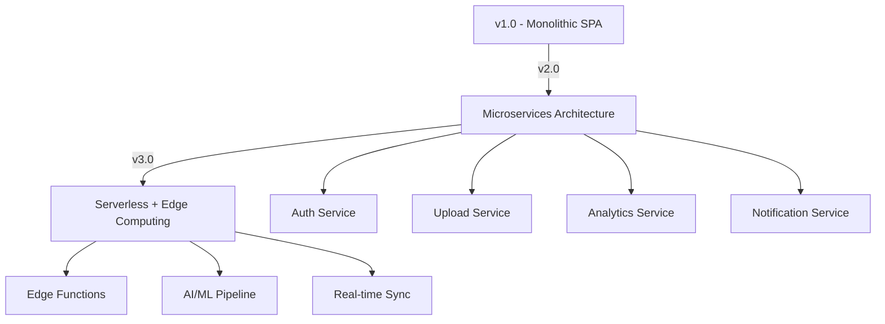

# Feature Roadmap

## Roadmap Overview

This document outlines the planned enhancements and new features for ClipShare, organized by development phases and priority levels. The roadmap is designed to evolve ClipShare from a simple file sharing tool into a comprehensive, feature-rich platform.

## Current Status (v1.0.0)

### ✅ Implemented Features
- Basic file upload and download
- Unique code generation and sharing
- Drag & drop interface
- Multi-file support
- Image previews
- Responsive design
- Automated deployment pipeline
- Supabase backend integration

## Phase 1: Core Enhancements (v1.1.0 - v1.3.0)

**Timeline:** October - December 2025  
**Focus:** Improving core functionality and user experience

### v1.1.0 - Security & Privacy Enhancements

#### 🔒 Security Features
- **Password Protection**
  - Optional password protection for uploads
  - Secure password hashing (bcrypt)
  - Password strength requirements
  - UI for password input on both upload and download

- **File Expiration Management**
  - Configurable expiration times (1h, 4h, 24h, 7d)
  - Automatic file cleanup system
  - Expiration countdown display
  - Email notifications before expiration (optional)

- **Download Limits**
  - Set maximum download count per upload
  - Track download attempts
  - Display remaining downloads
  - Auto-delete after limit reached

```javascript
// Example implementation
const uploadConfig = {
  password: 'optional_password',
  expiresIn: '24h', // 1h, 4h, 24h, 7d
  maxDownloads: 5,
  autoDelete: true
};
```

#### 🎯 User Experience Improvements
- **Enhanced Progress Tracking**
  - Individual file progress indicators
  - Upload speed display
  - ETA calculations
  - Pause/resume functionality (future)

- **Better Error Handling**
  - User-friendly error messages
  - Retry mechanisms for failed uploads
  - Network error recovery
  - Offline mode detection

### v1.2.0 - Advanced File Management

#### 📁 File Organization
- **Categories & Tags**
  - Auto-categorization by file type
  - Custom tags for uploads
  - Filter and search by category/tag
  - Batch operations on categories

- **File Previews Enhancement**
  - PDF preview support
  - Video thumbnails
  - Audio waveform previews
  - Text file content preview

- **Bulk Operations**
  - Select multiple files for upload
  - Batch download as ZIP
  - Bulk delete functionality
  - Mass file operations

#### 🔍 Search & Discovery
- **Advanced Search**
  - Search by file name, type, date
  - Filter by size, category, expiration
  - Search history and saved searches
  - Quick filters for common queries

### v1.3.0 - Collaboration & Sharing

#### 👥 Enhanced Sharing
- **QR Code Generation**
  - QR codes for easy mobile sharing
  - Customizable QR code design
  - Print-friendly QR codes
  - QR code analytics

- **Multiple Recipients**
  - Share single upload with multiple codes
  - Recipient-specific permissions
  - Individual download tracking
  - Notification system for recipients

#### 📊 Analytics & Insights
- **Transfer Analytics**
  - Download statistics and metrics
  - Geographic download distribution
  - Peak usage times analysis
  - User behavior insights

- **Dashboard Implementation**
  - Personal upload history
  - Usage statistics overview
  - Storage space tracking
  - Activity timeline

## Phase 2: Platform Features (v2.0.0 - v2.3.0)

**Timeline:** January - June 2026  
**Focus:** Platform expansion and advanced features

### v2.0.0 - User Accounts & Persistence

#### 👤 User Management System
- **Account Registration**
  - Email-based registration
  - Social media login (Google, GitHub)
  - Anonymous user support
  - Profile management interface

- **Persistent Storage**
  - Save uploads to account
  - Upload history and management
  - Favorite uploads system
  - Cross-device synchronization

#### 🎨 Customization & Theming
- **UI Customization**
  - Multiple theme options (dark, light, auto)
  - Custom color schemes
  - Layout preferences
  - Accessibility options

- **Branding Features**
  - Custom upload page branding
  - Personalized sharing links
  - Custom domain support
  - White-label options

### v2.1.0 - Real-time Features

#### ⚡ Live Updates
- **WebSocket Integration**
  - Real-time upload progress sharing
  - Live notifications for downloads
  - Instant status updates
  - Multi-user collaboration features

- **Live Collaboration**
  - Multiple users uploading to same code
  - Real-time file list updates
  - Collaborative file organization
  - Live chat for transfers (optional)

#### 🔔 Notification System
- **Multi-channel Notifications**
  - Email notifications
  - Browser push notifications
  - SMS alerts (premium feature)
  - Webhook integrations

### v2.2.0 - Integration & API

#### 🔌 Third-party Integrations
- **Cloud Storage Sync**
  - Google Drive integration
  - Dropbox synchronization
  - OneDrive support
  - iCloud compatibility

- **Communication Tools**
  - Slack integration
  - Discord bot
  - Microsoft Teams app
  - WhatsApp sharing

#### 🛠️ Developer API
- **REST API**
  - Full CRUD operations
  - Authentication system
  - Rate limiting and quotas
  - Comprehensive documentation

- **SDK Development**
  - JavaScript/TypeScript SDK
  - Python client library
  - Mobile SDKs (iOS, Android)
  - CLI tools

### v2.3.0 - Enterprise Features

#### 🏢 Business Solutions
- **Team Management**
  - Organization accounts
  - User role management
  - Team file sharing
  - Admin dashboard

- **Advanced Security**
  - SSO integration
  - LDAP/AD authentication
  - Audit logging
  - Compliance features (GDPR, HIPAA)

#### 📈 Scalability Improvements
- **Performance Optimization**
  - CDN integration
  - Edge computing support
  - Database optimization
  - Caching strategies

## Phase 3: Advanced Platform (v3.0.0+)

**Timeline:** July 2026 onwards  
**Focus:** AI features and ecosystem expansion

### v3.0.0 - AI & Machine Learning

#### 🤖 Smart Features
- **AI-Powered Organization**
  - Automatic file categorization
  - Smart tagging suggestions
  - Content analysis and insights
  - Duplicate file detection

- **Intelligent Compression**
  - AI-driven file optimization
  - Smart quality adjustments
  - Format recommendations
  - Automatic conversions

#### 🔍 Advanced Search
- **Semantic Search**
  - Content-based search
  - Image similarity matching
  - OCR for document search
  - Voice search capabilities

### v3.1.0 - Mobile & Cross-Platform

#### 📱 Native Mobile Apps
- **iOS Application**
  - Native iOS app (Swift/SwiftUI)
  - Camera integration
  - iOS-specific features
  - App Store optimization

- **Android Application**
  - Native Android app (Kotlin)
  - Android-specific integrations
  - Google Play optimization
  - Material Design implementation

#### 💻 Desktop Applications
- **Electron Desktop App**
  - Cross-platform desktop app
  - System tray integration
  - Drag & drop from desktop
  - Offline capabilities

### v3.2.0 - Ecosystem Expansion

#### 🌐 Browser Extensions
- **Chrome Extension**
  - Right-click context menu
  - Quick share from any webpage
  - Screenshot sharing
  - Tab sharing functionality

- **Firefox Extension**
  - Similar functionality to Chrome
  - Firefox-specific features
  - Privacy-focused options
  - Developer tools integration

#### 🔧 Developer Tools
- **VS Code Extension**
  - Share code snippets quickly
  - Project file sharing
  - Team collaboration features
  - Git integration

- **CLI Tools**
  - Command-line upload/download
  - Batch processing scripts
  - API testing tools
  - Automation capabilities

## Technical Roadmap

### Infrastructure Improvements

#### Database Evolution
```sql
-- v2.0 Schema additions
CREATE TABLE users (
  id UUID PRIMARY KEY,
  email VARCHAR UNIQUE,
  created_at TIMESTAMP,
  subscription_tier VARCHAR
);

CREATE TABLE upload_analytics (
  id UUID PRIMARY KEY,
  upload_id UUID REFERENCES uploads(id),
  event_type VARCHAR,
  data JSONB,
  timestamp TIMESTAMP
);

-- v3.0 Schema additions
CREATE TABLE ai_tags (
  id UUID PRIMARY KEY,
  upload_id UUID REFERENCES uploads(id),
  tag VARCHAR,
  confidence FLOAT,
  created_by VARCHAR DEFAULT 'ai'
);
```

#### Architecture Evolution


### Performance Targets

| Metric | v1.0 Current | v2.0 Target | v3.0 Target |
|--------|-------------|-------------|-------------|
| Load Time | <2s | <1s | <500ms |
| Upload Speed | Network limited | 2x improvement | 3x improvement |
| File Size Limit | 50MB | 1GB | 10GB |
| Concurrent Users | 100 | 10,000 | 1M+ |

## Feature Prioritization Matrix

### High Priority (Must Have)
- [ ] Password protection
- [ ] File expiration
- [ ] Download limits  
- [ ] Enhanced error handling
- [ ] QR code sharing
- [ ] User accounts

### Medium Priority (Should Have)
- [ ] Real-time features
- [ ] Cloud storage integration
- [ ] Mobile apps
- [ ] Advanced analytics
- [ ] Team features
- [ ] API development

### Low Priority (Nice to Have)
- [ ] AI features
- [ ] Browser extensions
- [ ] Desktop apps
- [ ] Voice search
- [ ] Enterprise features
- [ ] White-label options

## Implementation Strategy

### Development Phases
1. **Foundation** (Current) - Core functionality
2. **Enhancement** (v1.x) - Improve existing features
3. **Expansion** (v2.x) - Add major new features
4. **Innovation** (v3.x) - AI and advanced features

### Resource Allocation
- **Frontend Development:** 40%
- **Backend Development:** 30%
- **Mobile Development:** 15%
- **DevOps/Infrastructure:** 10%
- **Design/UX:** 5%

### Risk Mitigation
- Incremental feature rollout
- Feature flags for gradual deployment
- A/B testing for major changes
- Comprehensive testing at each phase
- User feedback integration

## Success Metrics

### User Engagement
- Monthly active users growth
- File upload/download volumes
- Session duration and frequency
- Feature adoption rates

### Technical Performance
- Application performance metrics
- Uptime and reliability
- Error rates and resolution times
- Security incident tracking

### Business Metrics
- User acquisition cost
- Revenue per user (future)
- Customer satisfaction scores
- Market share growth

This roadmap is designed to be flexible and will be updated based on user feedback, technical constraints, and market opportunities. Regular reviews will ensure the roadmap remains aligned with project goals and user needs.